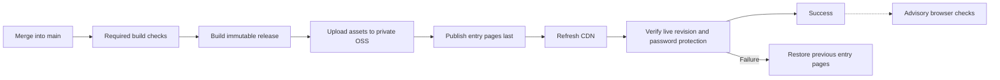

# Updating and operating the website

## What an agent needs

Write access to `younggzzheng/fergusonhealth`, permission to open and merge the
requested PR, and access to Actions runs. This repository contains the source,
original design references, tests, deployment code, and infrastructure IDs.
Production secrets are already configured in GitHub. Never use Baseten's
`youngzheng-oss` account for this project.

A read-only clone can prepare and test edits. Privileged operations run inside
Actions using a dedicated Alibaba identity, without extracting the key.
See [credential details](CREDENTIALS.md).

## Main branch approval policy

The accounts `younggzzheng` and `fergusonhealth` can push directly to `main`
or merge a PR without review approval. Any other account must submit a PR
and obtain one approval before merging; new commits dismiss older approvals.
GitHub evaluates the authenticated pushing or merging account, not the author
name attached to a commit. Collaborators still need repository write access.
Every push to `main` triggers the same deployment workflow, including direct pushes.

The active rule is [Main requires approval except trusted publishers](https://github.com/younggzzheng/fergusonhealth/rules/24311083).
Its configuration is saved in `infra/main-branch-ruleset.json`. A repository
administrator can reapply it with the following command after reviewing any
configuration changes; editing the JSON alone does not update GitHub's policy:

```sh
gh api --method PUT -H 'X-GitHub-Api-Version: 2026-03-10' \
  repos/younggzzheng/fergusonhealth/rulesets/24311083 \
  --input infra/main-branch-ruleset.json
```

## Edit, check, and merge

```sh
gh repo clone younggzzheng/fergusonhealth
cd fergusonhealth
git switch -c content/describe-the-change
npm ci
npx playwright install chromium
```

Read `AGENTS.md` first. Edit English in `draft/index.html`, Chinese in
`draft/site.js`, and styles in `draft/styles.css`. Published images belong in
`draft/assets/`; other references are not deployed. Preserve the actual QR and
its destination and white margin. Keep browser dependencies local to the website.
The contact email is plain selectable text; no form service is needed.

```sh
python3 -m unittest discover -s tests -p 'test_*.py'
npm test
python3 build.py --revision "$(git rev-parse HEAD)"
```

Inspect English/Chinese/French/German desktop/mobile layouts and test links and
navigation. English HTML is the source for French and German copy; preserve
proper names, credentials, and the original scope of services. Translation
dictionaries live in `draft/site.js` and `draft/insights.js`; shared language
controls in `draft/languages.js` retain the selection across both pages. The
video remains in English and is labelled accordingly in each language.
Then commit, push, and open a PR against **main**. Use a file for multiline PR
bodies:

```sh
git add draft/
git commit -m "Describe the website update"
git push -u origin HEAD
gh pr create --base main --draft --title "Describe the update" --body-file /tmp/pr-description.md
gh pr checks PR_NUMBER
```

When the task authorizes publishing and required checks pass, mark the PR ready
and merge. Browser checks are advisory: review their results, but slow image or
font loading and layout warnings do not block publishing. PR creation does not
authorize unrelated changes.

```sh
gh pr ready PR_NUMBER
gh pr merge PR_NUMBER --merge --delete-branch
gh run list --workflow ci.yml --branch main --limit 5
gh run watch RUN_ID --exit-status
```

The repository is public. Reading or cloning it does not grant publishing
permission; maintainers need write/Actions access. Always check the PR before
merging. The main workflow checks again, so failed required checks prevent
deployment even if someone merges a broken change.

## What happens after a merge



The build contains a manifest of file SHA256 hashes and a full git revision.
Assets use `/releases/<revision>/...` URLs. Updating the entry page selects that
set of assets; old assets remain available for rollback. Editing or pushing a
feature branch does not directly change the live website.

Required live verification checks the expected revision, entry-page and
stylesheet/script hashes, successful password entry, representative protected
asset URLs, invalid passwords, logout, and private OSS. Network requests allow
90 seconds and retry transient failures; release propagation also gets time to
settle. Verification does not download every image or font, and there is no
page-speed budget. The build still checks that referenced local files exist.

Detailed browser checks inspect rendering, all four languages, images, links, and
layout. They run in separate advisory jobs: a failure or timeout is visible in
Actions but does not block publishing or restore the previous release. Their
browser installation and runtime do not hold up the deployment job. Review
warnings when relevant to the edit; content growth and slower loading alone
are not reasons to reject an update. Deployment and backend maintenance share
a serialization group. An old queued main build is skipped when a newer main
revision exists.

The **Deploy and verify production** job and its reported live revision are the
source of truth for publishing success. Advisory browser warnings do not change
that result. Read the job logs and download test/build artifacts when needed:

```sh
gh run view RUN_ID
gh run view RUN_ID --log-failed
gh run download RUN_ID --dir /tmp/ferguson-artifacts
```

Production passwords, authentication headers, cookies, and raw CDN rules must
not be logged or included in uploaded test traces.

## Backend operations using repository access

These run trusted main code on GitHub's runner with repository secrets. Status
prints selected non-secret fields only.

```sh
# Current CDN/gate state and deployed revision.
gh workflow run backend.yml --ref main -f operation=status

# Refresh the site's CDN entry pages.
gh workflow run backend.yml --ref main -f operation=refresh

# Check and redeploy the current main commit.
gh workflow run ci.yml --ref main -f operation=deploy

# Verify the live site against the current main commit without republishing.
gh workflow run ci.yml --ref main -f operation=verify

gh run list --limit 5
```

For another diagnostic, modify `backend.py` on a PR and follow the same review
and merge process. Its identity is limited to `infra/ram-policy.json`. Do not
broaden the identity to work around failures. It cannot change DNS/email,
bucket ACLs, RAM accounts, or unrelated services.

## Rollback and failures

If essential verification fails after entry pages change, the deployer restores the
previous copies and refreshes their CDN URLs. The workflow remains failed so
the problem is visible. Read both failure and rollback results before retrying.
Advisory browser failures do not cause rollback.

For a content mistake that passes technical checks, revert on a new branch and
merge the revert PR after checks. A merge commit uses `git revert -m 1 SHA`;
a normal commit uses `git revert SHA`. This creates an auditable new release.
Do not force-push main or delete release objects during an incident.

An interrupted job or Alibaba/network outage can prevent rollback completing.
Check the reported deployed revision and backend status, then republish a
known-good change through main. A passing build alone is not proof of a live
site. For local deployments with separately provided authorized secrets, use
`python3 build.py --revision FULL_SHA`, then `python3 deploy.py`. Add `--browser`
to run advisory browser checks after essential verification; browser failures
only produce a warning. Use `python3 verify_preview.py --manifest dist/release.json`
for the essential HTTP checks.

## Hosting inventory

| Item | Value |
| --- | --- |
| Public address | `https://www.fergusonhealth.com/` |
| Alibaba account | `1991436433422753` |
| OSS bucket / region | `fergusonhealth-cn-web` / `cn-shanghai` |
| OSS endpoint | `fergusonhealth-cn-web.oss-cn-shanghai.aliyuncs.com` |
| CDN domain | `www.fergusonhealth.com` |
| CDN CNAME | `www.fergusonhealth.com.w.cdngslb.com` |
| RAM deploy user | `fergusonhealth-github-actions` |
| RAM deploy policy | `FergusonHealthGithubDeploy` |
| ICP filing | `沪ICP备15040582号-1` |

OSS remains private. The existing CDN EdgeScript authenticates requests before
serving website files, with `/preview.html` as the public login screen. The
live rule is managed separately from routine content deployment; never upload
`preview_gate.es` to OSS. Its placeholders are not credentials. Login sets a
Secure, HttpOnly, SameSite=Strict preview cookie; logout clears it. The site
remains a private draft with no-index headers.
